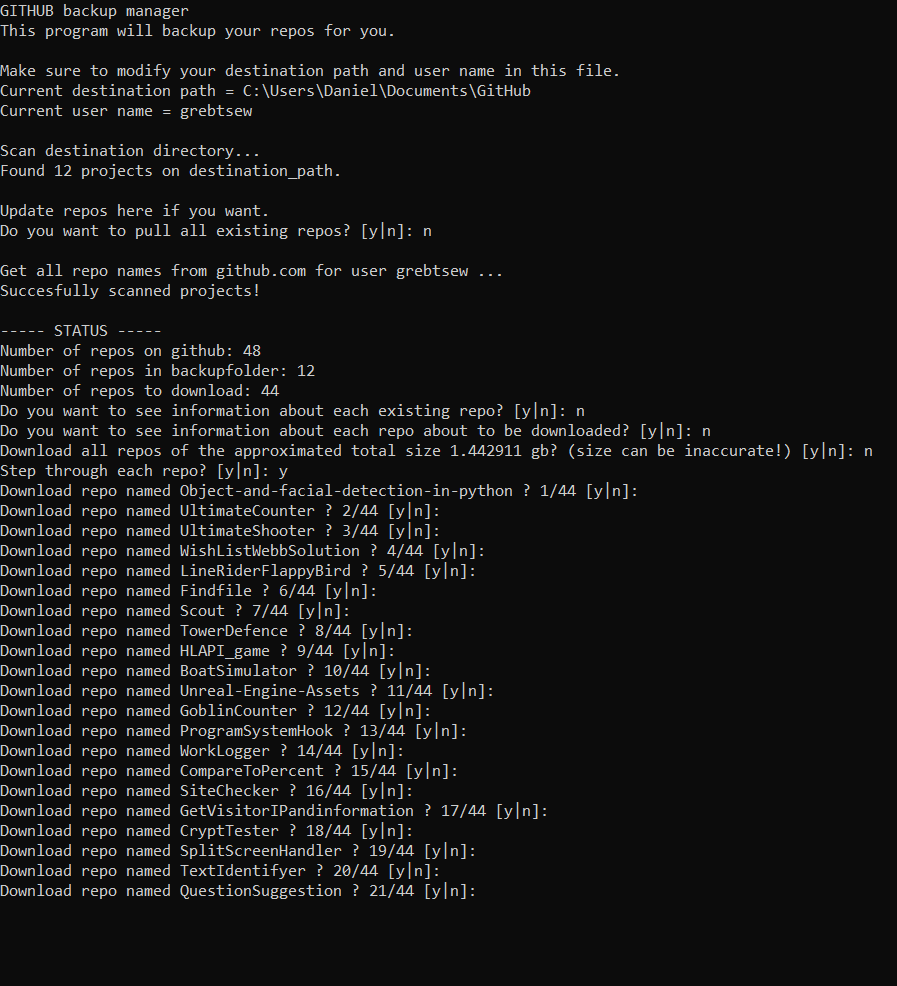

# github_backup_manager

As the amount of developed projects on Github increase the struggle to keep up-to-date backups on local drives increase.
I created this project to solve the issue.

## How?
This program uses scraping and github api do the following actions:
1. Get system data from destination folder and preform updates on repos (windows only)
2. Scrape github for existing public repos of user
3. Calculate approximated size of download by talking to github api (very few requests per day!)
4. Show and download each repo that doesn't exist

## Motivation
I use this program to keep an up-to-date backup off my github repos on an external hdd.

## Start
1. Make sure to install python3, git and all required libraries.
* os
* platform
* ntpath
* subprocess
* BeautifulSoup
* requests
* datetime
2.  Edit destination_path and user_name at the top of main.py file.
3. Run main.py
```
python main.py
```

## Screenshot
During execution the program will ask a couple of questions on how to proceed. See screenshot below:


